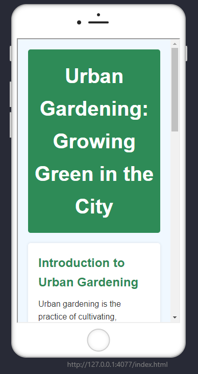

# Urban Gardening: Growing Green in the City

This project is a simple, responsive HTML and CSS website that introduces the concept of urban gardening. It was created as part of a Coursera course project.

## Live Demo

- **Live View:** [Open in Browser](https://ShahriarTbc.github.io/Create_HTML_Project_coursera)
- **Mobile Screenshot:**
  
  

## Features

- **Responsive Design:** Looks great on both desktop and mobile devices.
- **Modern UI:** Clean, professional look with a focus on readability and accessibility.
- **Semantic HTML:** Uses semantic tags for better structure and SEO.
- **Custom CSS:** Styled with a custom `style.css` for a unique appearance.

## Project Structure

```
├── index.html        # Main HTML file
├── style.css         # Custom CSS styles
├── Screenshot.png    # Mobile view screenshot
```

## How to Use

1. **Clone the repository:**
   ```sh
   git clone https://github.com/ShahriarTbc/Create_HTML_Project_coursera.git
   ```
2. **Open `index.html` in your browser.**

## About the Project

This project demonstrates the basics of web development using only HTML and CSS. The topic, "Urban Gardening: Growing Green in the City," is presented with:
- A visually appealing header
- Informative sections
- Styled lists and blockquotes
- A clean, readable layout

## Author

- **Shariar Ahamed**
- [GitHub Repository](https://github.com/ShahriarTbc/Create_HTML_Project_coursera)

## License

This project is for educational purposes.
